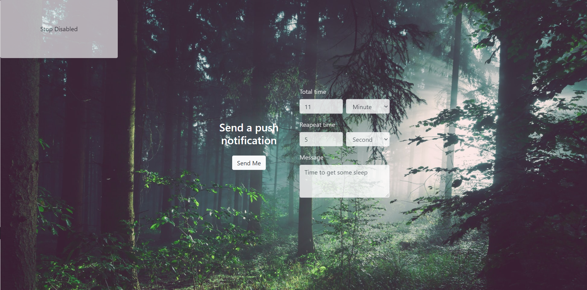

[Visit Website](https://pushsendnoti.herokuapp.com/)

## Push Notification using Nodejs   
**Key features**
- Service Worker & Web-push
  - Register Service Worker
  - Register Push Service Worker
  - Push Notification repeatly
 - User's Session Store & express-session  
 
**Register Service Worker in javascript**
```javascript
if ('serviceWorker' in navigator){
        console.log("register the service worker")
        const resgister = await navigator.serviceWorker.register('/worker.js', {
            scope:'/'
})
```
**Register Service Worker to Push**
```javascript
const convertedVapidKey = urlBase64ToUint8Array(vapidPublicKey);
        const sub = await resgister.pushManager.subscribe({
            userVisibleOnly: true, 
            applicationServerKey: convertedVapidKey, 
})
```
**Set Vapid key to use Web-push**
```javascript
webPush.setVapidDetails(
    'mailto:test@test.com',
    process.env.public_key,
    process.env.private_key, 
)
```
**Create Route to Push Notification to user**
```javascript
app.post('/subscribe',  (req,res)=>{
    // get pushSubscription object
    const subscription = req.body
    // resource is created 
    const sub = subscription['sub']
    const data = subscription['data']
    const session_data = subscription['session_data']
    // Store data in the session
    req.session.status = data.status
    req.session.data = session_data
    res.status(201).json({})
    const payload = JSON.stringify(data)
    webPush
        .sendNotification(sub, payload)
        .catch(err=>console.error(err))

})
```
**Add Push eventlistener to Service Worker**
```javascript
const send_notification = (data) =>{
    // console.log(data)
    self.registration.showNotification("From viet", {
        body: data,
        icon: "http://image.ibb.co/frYOFd/tmlogo.png"
    })
}

self.addEventListener("push", e => {
    const data = e.data.json();
    console.log("data",  data)
    if (data.sending == true){
        timeId = setInterval(() =>{
            if (data.message == ""){
                send_notification("Hello, how are you today? ")
            console.log("sent default push ");

            }else{
                send_notification(data.message)
        console.log("sent LAST push ");
            }
        }, data.interval);
        console.log("time id", timeId)
        
        setTimeout(() => {
            console.log
            clearInterval(timeId)
            // send_notification("This is your last reminder")
        }, data.time);
    }
    else if (data.sending == false){
        console.log("time id", timeId)
        if (timeId){
            clearInterval(timeId)
        }
        send_notification("Manually stop the Notification!!")
        console.log("stoped the push")

    }
    console.log("------------------------")
})

```
